# MM3

**A System One needs a Knowledge One.**

<p align="center"></p>

Turn a yes/no checklist about your code into a calibrated pass / fail / unsure verdict, and keep everything it learns.

[](LICENSE) [](https://www.npmjs.com/package/@mvpscale/mm3) [](#install)

```
Builders want agents that make the call…    minus the homework they graded themselves.
Founders want every merge reviewed…         without paying twice for the same answer.
```

## See it

<p align="center"></p>

The code (`src/user.ts`):

```ts
export async function getUser(req, db) {
  return db.query("SELECT * FROM users WHERE id = " + req.query.id);
}
```

You ask: the full request — 3 concerns categories (9 yes/no probes) plus a severity scale and a routing choice:

```yaml
mak:
  goal: This login handler is safe to merge
  depth: quick
  where: [src/user.ts:1-3]
  ask:
    concerns:
      injection:
        pass: no
        1: Is request text placed directly into the SQL query?
        2: Is the query built with string concatenation instead of a bound parameter?
        3: Does the query run with db.query on that concatenated string?
      access:
        pass: no
        need: most
        tags: [sql, backend]
        4: Is the id checked to be a number before use?
        5: Could one user read another user's record?
        6: Can any caller read any record without a permission check?
      leaks:
        pass: no
        7: Does the error sent back reveal the query?
        8: Does the code log an email address?
        9: Does the response include fields the caller didn't ask for?
    decisions:
      severity:
        pass: [none, low]
        10:
          scale: How severe is the worst issue?
          levels: [none, low, medium, high, critical]
      route:
        pass: [ship]
        11:
          choice: Where should this go?
          options: [ship, fix, block]
mdl:
  why: validate
  area: data
```

You get: one call to TypeSafe's Jev, real output:

```yaml
mak:
  id: MM3-0001
  gate: fail
  goal: {gate: fail, p: 0.02}
  injection: {gate: fail, 1: 0.98, 2: 0.93, 3: 0.95}
  access:    {gate: fail, 4: 0.92, 5: 0.84, 6: 0.79}
  leaks:     {gate: unsure, 7: 0.48, 8: 0.01, 9: 0.20}
  severity:  {gate: fail, 10: {top: critical, p: 0.97}}
  route:     {gate: fail, 11: {top: fix, p: 0.55}}
  consensus: STRONG
  escalate: false
mdl: {recorded: [why, area]}
next: mm3 template drill --parent MM3-0001 --from injection
```

Every concern has its own verdict and odds. The goal fails, severity is critical, and `next:` says where to look deeper. It's all kept, reused free until the code changes, and mapped by `mm3 report`.

## Install

**Claude Code:**
```
/plugin marketplace add mvp-scale/Sidewise
/plugin install mm3@mvp-scale
```
Pick **project** scope. For the key: press Enter on "TypeSafe API key", paste, Enter, "Save configuration".

**Anywhere else** (terminal, Codex, Gemini CLI…), inside your project:
```bash
npx @mvpscale/mm3 init
```
Needs Node 22.13+. No key? Free sample answers, clearly labelled, never evidence.

## Quickstart

```bash
# mm3-quickstart
mm3 template class > review.yaml
mm3 class review.yaml
mm3 view src
mm3 report
mm3 outcome MM3-0001 held --by you
mm3 budget
```

Agents: run `mm3 agent` first. Humans: `mm3 help`.

## Why: a Knowledge One system

Classifiers got good. TypeSafe's Jev answers a plain question about your code with a calibrated yes or no, fast, for a fraction of a cent. Drop one into your agent and it will make a bad call you can't trace. Running it ten more times is louder, not smarter.

What's needed is a standard way to ask, and a place to keep what you learn:

```
1. Engineering leads want a decision…       without betting on one angle.
2. Founders want answers now…               without paying twice.
3. Builders want answers they can act on…   minus yesterday's code.
4. Security teams want proof a fix worked…  instead of self-approval.
5. Vibe coders want to get wiser…           instead of starting from zero every morning.
6. You…                                     tell us what we missed.
```

MM3 splits the problem in half: **Side** decides now, **Wise** learns as you go.

## Honest status

Tested end to end with Claude Opus 5.5 and Sonnet 5 on a real app with planted flaws; other agents next. Built on TypeSafe's Jev; other classifiers can plug in. Our last full test: $0.0005 for a whole review session.

## More

[The contract](docs/contract.md) · [Evidence for every claim](docs/evidence/README.md) · Apache-2.0, free. Enjoy.
