<h1 align="center"><picture><source media="(prefers-color-scheme: dark)" srcset="docs/assets/wordmark-dark.svg"></picture></h1>

<p align="center"><b>Checklists in. Calibrated verdicts out.</b></p>

<p align="center">MM3 turns a short numbered yes/no checklist into a calibrated pass/fail/unsure verdict your coding agent can cite.</p>

<p align="center"><a href="https://github.com/mvp-scale/Sidewise/actions/workflows/ci.yml"></a> <a href="LICENSE"></a> <a href="#install"></a></p>

<p align="center"><picture><source media="(prefers-color-scheme: dark)" srcset="docs/assets/how-it-works-dark.svg"></picture></p>

- [$0.000065 per check (median of five paid class runs)](docs/numbers.md#cost-per-check)
- [1,107 tests, no network, no key](docs/numbers.md#test-count)
- [12/12 verb and depth choices right in an agent smoke test on OWASP NodeGoat](docs/numbers.md#agent-smoke-score)

## Install

In Claude Code, from your project:

```text
/plugin marketplace add mvp-scale/Sidewise
/plugin install mm3@mvp-scale
```

Pick **project** scope. Claude asks for a TypeSafe API key (masked, optional): press Enter on "TypeSafe API key", paste, Enter, then "Save configuration". Leave it empty to use the free sample provider.

In a terminal, or with Codex or Gemini CLI (needs Node 22.13+):

```bash
npm install -g @mvpscale/mm3
mm3 init
```

**Status: pre-release.** The package publishes with the first release; until then use the plugin above, or build from a clone (see [AGENTS.md](AGENTS.md)). Nightly builds will land as `@mvpscale/mm3@nightly`.

### Try it with no key

With no key set, MM3 runs on a built-in sample provider: free, offline, and its answers are canned and labelled, never evidence. To force it even when a key is set, run `MM3_PROVIDER=fake mm3 class review.yaml`. Every line below runs in order in a fresh project:

```bash
# mm3-quickstart
mm3 template class > review.yaml
mm3 class review.yaml
mm3 view src
mm3 report
mm3 outcome MM3-0001 held --by you
mm3 budget
```

Agents: run `mm3 agent` first. Humans: `mm3 help`.

## See it run

<!-- demo: Task 3 -->

An agent was asked, on OWASP NodeGoat: *"Take a first look: is that contribution handler safe to merge as it stands?"* It wrote this request (42 lines, opened below) and got one answer from one call.

<details>
<summary>The request the agent wrote</summary>

```text
mak:
  goal: The `handleContributionsUpdate` handler rejects unsafe input and is safe to merge
  verb: class
  depth: quick
  where: [app/routes/contributions.js:24-72]
  ask:
    concerns:
      injection:
        pass: no
        1: Is `req.body.preTax`, `req.body.afterTax` or `req.body.roth` read from the request body in `handleContributionsUpdate`?
        2: Are those body values passed to a parser that only accepts numbers, rather than to a code evaluator?
        3: Does `handleContributionsUpdate` run those body values through `eval`?
      input:
        pass: yes
        4: Are `preTax`, `afterTax` and `roth` checked for NaN and negative values before use?
        5: Is the combined total of `preTax`, `afterTax` and `roth` capped before the DAO update?
        6: Does `handleContributionsUpdate` return an error page instead of updating when validation fails?
      access:
        pass: yes
        7: Is `userId` taken from `req.session` rather than from `req.body`?
        8: Is the update passed to `contributionsDAO.update` keyed only by that session `userId`?
        9: Does the response render only the caller's own contributions record?
    decisions:
      severity:
        pass: [none, low]
        10:
          scale: How severe is the worst issue found in `handleContributionsUpdate`?
          levels: [none, low, medium, high, critical]
      route:
        pass: [ship]
        11:
          choice: Where should `handleContributionsUpdate` go?
          options: [ship, fix, block]
mdl:
  why: validate
  area: [api]
  stage: pre-merge
  problem: Is handleContributionsUpdate in contributions.js safe to merge as it stands
  uses:
    - component:web-app/contributions-handler -> code:handleContributionsUpdate -> component:web-app/contributions-dao
  touches: [preTax, afterTax, roth, userId]
  blast: person
```

</details>

The response, **real output · jev-1.13.0 · 2026-09-29 · $0.000048**:

```text
mak:
  id: MM3-0001
  gate: fail
  goal: {gate: fail, p: 0.06}
  injection: {gate: fail, 1: 0.99, 2: 0.08, 3: 0.98}
  input: {gate: pass, 4: 0.95, 5: 0.94, 6: 0.95}
  access: {gate: unsure, 7: 0.99, 8: 0.71, 9: 0.55}
  severity: {gate: fail, 10: {top: critical, p: 0.96}}
  route: {gate: fail, 11: {top: fix, p: 0.70}}
  consensus: SPLIT
  escalate: true
mdl: {recorded: [why, area, stage, problem, uses, touches, blast]}
next: mm3 template drill --parent MM3-0001 --from injection
notes: [cost estimated from tokens (no live pricing reported), budget 0% used ($0.00 of $5.00 · 1 of 500 runs)]
```

Each concern gets its own verdict and odds. The handler reads the request body (0.99) and runs it through `eval` (0.98), so injection fails and the goal fails with it. Input checks pass. Access is unsure. Severity is critical, and the concerns disagree, so MM3 sets `escalate: true` and `next:` names the drill that digs into injection. The agent ran that drill, fixed the `eval`, and ran a `replay` to prove it: the goal now passed at 0.92, with the guard and sink concerns still open. The paths above are relabelled from the scratch checkout the run used; the answer is unchanged.

## What you get

|  | **Know** | **Judge** | **Prove** |
|---|---|---|---|
| **MAK³** · use what is proven | `view`: a free lookup of what is on record | `class`: one subject, one verdict | `replay`: recheck after a fix |
| **MDL³** · learn what is missing | `scan`: sweep to find where to look | `drill`: dig into one weak spot | `loop`: vet a design before code |

A request has a `mak:` block (the checklist) and an optional `mdl:` block (why you are asking, so the ledger learns). The verb you run, not the key, decides whether it is a MAK³ or an MDL³ move. `mm3 help <verb>` shows the rules for each; `mm3 template <verb>` prints a filled-in sample.

Every run and its outcome goes into an append-only ledger in `.mm3/` (git-ignored). Ask the same questions of unchanged code and MM3 answers from the ledger: no call, no cost. `mm3 report` reads back where your agents keep going wrong, and a budget cap, which only you reset, stops runaway spend. `mm3 view` looks a request up in the ledger before you spend anything.

## Why we built it

Classifiers got good: TypeSafe's Jev answers a plain yes/no about your code, calibrated, for a fraction of a cent. But an agent that asks once makes a call you can't trace, and asking ten more times is louder, not smarter.

MM3 is a Knowledge One system. It sits on a System One (a fast classifier) and adds a standard way to ask and a place to keep what you learn: one checklist in, a verdict per concern out, every answer kept and reused.

## What you can do

- **Check a change before you merge it.** One `class` call, three angles per concern, a verdict for each. Start with `mm3 template class`.
- **Prove a fix actually worked.** `replay` re-asks a past run's own questions across two commits, so you check the fix without re-checking everything. Start with `mm3 template replay`.
- **Find where a problem lives.** `scan` sweeps a folder and ranks the files that most need a look. Start with `mm3 template scan`.
- **Check a design before any code exists.** `loop` puts a plan through the same checklist before anyone writes it. Start with `mm3 template loop`.

Each template is a filled-in request with its rules as comments.

<details>
<summary>A request you can dry-run in this repo</summary>

`mm3 class review.yaml --dry-run` validates it and counts its questions without spending anything.

```yaml verb=class
mak:
  goal: An answer is reused only while the code it was given on is unchanged
  depth: quick
  where: [src/ledger/reuse.ts:193-260, src/ledger/stale.ts]
  ask:
    concerns:
      freshness:
        pass: yes
        1: Does the check compare the code's current state with the state the answer was given on?
        2: Is an answer dropped once the code it was given on has changed?
        3: Is that comparison made before any call is sent?
      lookup:
        pass: yes
        4: Is a stored answer looked up by the exact question set?
        5: Is the lookup keyed on the question text and the code state together?
        6: Is a lookup miss treated as "ask", not as an error?
      spend:
        pass: yes
        7: Does a reused answer cost nothing?
        8: Is each reuse recorded in the ledger?
        9: Is a reused answer labelled as reused?
    decisions:
      severity:
        pass: [none, low]
        10:
          scale: How severe is the worst issue found?
          levels: [none, low, medium, high, critical]
      route:
        pass: [ship]
        11:
          choice: Where should this go?
          options: [ship, fix, block]
mdl:
  why: validate
  area: data
```

</details>

## Limits and alternatives

- **Evidence, never a command.** You get an agreement strength and a lean; you or your agent decide. Delete, deploy, drop and pay stay human.
- **A false pass costs you.** A calibrated 0.9 is wrong about one time in ten. `unsure` is a real answer, and `mm3 outcome` grades each verdict so the ledger can show which ones to distrust.
- **Not a linter, scanner or test suite.** Those find known patterns, deterministically, for free. Run them first. MM3 answers the questions they can't put: does this handler check the caller, will this design hold.
- **Not a second opinion.** A second full-context model review reads everything and costs far more. Use one when the question won't fit a yes/no.
- **The sample provider is not evidence.** Its answers are canned. Built on TypeSafe's Jev; other classifiers can plug in.
- **Pre-release.** Tested end to end on a real app with planted flaws (see the numbers above). Not yet on npm.

## Docs and contributing

- [The contract](docs/contract.md): every claim the answer format makes
- [Evidence for each claim](docs/evidence/README.md) and [where the numbers come from](docs/numbers.md)
- [The agent skill](skills/mm3/SKILL.md), and `mm3 agent` / `mm3 help` in your terminal
- Contributing: see [AGENTS.md](AGENTS.md) for commands, test tiers and rules. Open pull requests against the `nightly` branch.

## License

[Apache-2.0](LICENSE) · [Contributing](AGENTS.md) · [Issues](https://github.com/mvp-scale/Sidewise/issues)
