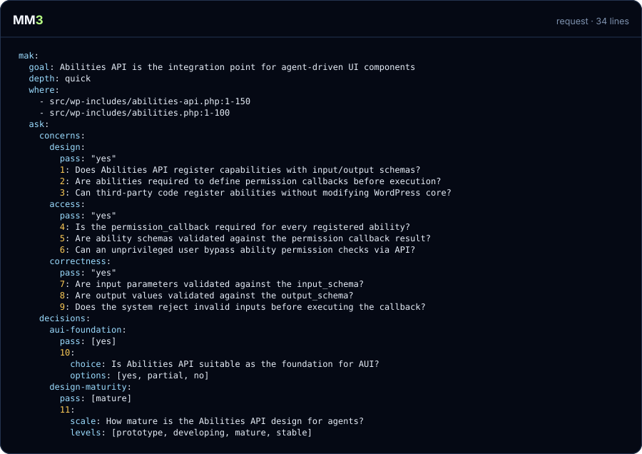
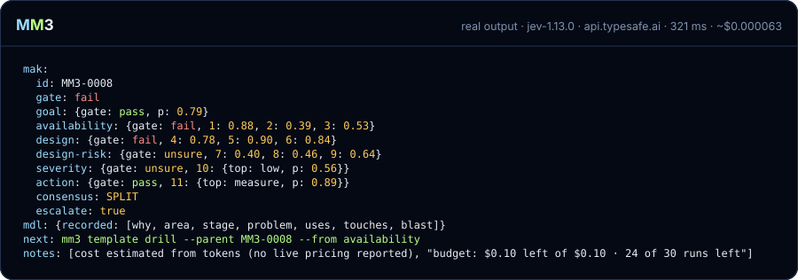

<h1 align="center"><picture><source media="(prefers-color-scheme: dark)" srcset="docs/assets/wordmark-dark.svg"></picture></h1>

<p align="center"><b>Checklists in. Calibrated verdicts out.</b></p>

<p align="center">MM3 turns a short numbered yes/no checklist into a calibrated pass/fail/unsure verdict your coding agent can cite.</p>

<p align="center"><a href="https://github.com/mvp-scale/mm3/actions/workflows/ci.yml"></a> <a href="LICENSE"></a> <a href="#install"></a></p>

<p align="center"></p>

## Install

In Claude Code, from your project:

```text
/plugin marketplace add mvp-scale/mm3
/plugin install mm3@mvp-scale
```

Pick **project** scope. Claude asks for a TypeSafe API key (masked, optional): press Enter on "TypeSafe API key", paste, Enter, then "Save configuration". Leave it empty to add one later with `mm3 init`.

In a terminal, or with Codex or Gemini CLI (needs Node 22.13+):

```bash
npm install -g @mvpscale/mm3
mm3 init
```

**Status: beta.** Early testing has been strong, and more worked examples are coming. The plugin works today; the npm package publishes with the first release.

### Try it locally

Bring your key and point MM3 at any compatible endpoint URL. `mm3 init` stores the key; set the URL with `baseURL:` in `.mm3/config.yaml`, or per run with `MM3_BASE_URL=https://api.example.com mm3 class review.yaml`.

Then just ask your agent. The MM3 skill tells it when to reach for MM3, which verb fits and how to write the request; you read the verdict.

## See it run

**The challenge:** you host n8n yourself and want it to run faster. You ask your agent where to start. It narrows the question to one place, the node loader's cleanup in `directory-loader.ts`, and asks MM3 twelve questions about it in one call: nine yes/no, two decisions and the goal itself.

<br>

<p align="center"></p>

<br>

The request the agent wrote (45 lines):

<p align="center"></p>

The response, **real output · jev-1.13.0 · api.typesafe.ai · 321 ms · ~$0.000063**:

<p align="center"></p>

- Every concern is written so that "no" is healthy: a `pass: no` answer clears the bar at 0.30 or below.
- **Goal: pass** (0.79). Yes, this cleanup could be faster.
- **Availability: fail.** At 0.88, the `realpathSync()` calls on line 606 block the event loop.
- **Design: fail** on all three: a rescan on every `unloadAll()` call (0.78), a try-catch that silently skips errors (0.90), and caching would help (0.84).
- **Design-risk: unsure.** None of 0.40, 0.46, 0.64 lands clearly either way.
- **Decisions:** measure first passes (0.89); severity is unsure (low, 0.56).
- **Next:** the concerns disagree, so consensus is SPLIT, `escalate` is true, and `next:` points at a drill into availability. The `mdl:` line lists what the ledger recorded about why the agent asked, so later runs on this code start from it.

## Two stories, step by step

Two real stories, each driven by a Haiku agent on unmodified public source: **MAK³ · make**, “Where do agents plug into WordPress?” (WordPress @ 3ffb1df), and **MDL³ · model**, “I've never worked in n8n and I want it faster” (n8n@2.40.7, then n8n@2.41.3). Every step is one run: the task the agent was given, the request it fired, the response MM3 returned, a quick read of it, the decision it implies and what the ledger now holds. Every footer comes from that run's own ledger row.

<p align="center"><a href="https://mm3lab.dev/#run">Step through both stories on mm3lab.dev →</a></p>

## Earlier runs, under the old name

Before MM3 it was Sidewise: `side:`/`wise:` instead of `mak:`/`mdl:`, and `SW-` run ids. These ran on OWASP NodeGoat, a deliberately vulnerable Node app the agent had never seen. Output is shown as it ran, trimmed.

**The agent calls it before it asks:**

> Expected a hard "no" given the visible `eval()` call — this is textbook NodeGoat A1 SSJS injection.

**It asks.** One handler, twelve questions. The injection part:

```yaml
side:
  goal: The contribution handler in `app/routes/contributions.js` is safe to merge as it stands
  where: [stage/NodeGoat/app/routes/contributions.js]
  ask:
    concerns:
      injection:
        pass: no
        1: Does `handleContributionsUpdate` pass `req.body` values into `eval`?
        2: Can a request field reach code execution instead of only being parsed as a number?
        3: Does `handleContributionsUpdate` run `eval` before any validation of the value?
```

**The guess holds:**

```yaml
side:
  id: SW-0001
  gate: fail
  injection: {gate: fail, 1: 0.99, 2: 0.95, 3: 0.98}
  severity: {gate: fail, 10: {top: critical, p: 0.94}}
  route: {gate: fail, 11: {top: fix, p: 0.74}}
next: sidewise template drill --parent SW-0001 --from injection
```

**It drills, then fixes.** The drill (SW-0004) confirms all three fields reach `eval`. The fix:

```diff
-        const preTax = eval(req.body.preTax);
-        const afterTax = eval(req.body.afterTax);
-        const roth = eval(req.body.roth);
+        const preTax = parseInt(req.body.preTax, 10);
+        const afterTax = parseInt(req.body.afterTax, 10);
+        const roth = parseInt(req.body.roth, 10);
```

**It proves the fix.** Same questions, before and after the commit:

```yaml
side:
  parent: SW-0004
  compare: {before: c5cb68a, after: 9292b00}
  expect: [sink, guard]
```

```yaml
side:
  id: SW-0005
  sink: {before: fail, after: pass, fixed: [7, 8, 9]}
  guard: {before: fail, after: fail, fixed: [4], still: [5, 6]}
  expected: {fixed: [sink], still: [guard]}
  unexpected: [reach]
  regressed: []
  reused: [SW-0001, SW-0004]
```

The `eval` is gone. `guard` still fails: nothing limits the fields to digits, so `parseInt("5abc")` still reads 5. The "before" answers came straight from the ledger; only the new code cost a call.

This verb started out as `change`. We expected a diff between two answers. It turned out to be a replay, the same questions on the new code, and it worked better than planned.

**Then it went wide.** One run per piece of a C4 map: the web app, its router, each handler and its DAO, MongoDB. Each run records where it sits, so the ledger ends up holding the architecture, and every edge cites the runs behind it:

```text
$ sidewise report graph container:mongodb
container:web-app --uses--> container:mongodb (declared) [SW-0016]
component:web-app/user-dao --uses (×3)--> container:mongodb (declared) [SW-0016, SW-0019, SW-0027]
component:web-app/allocations-dao --uses (×3)--> container:mongodb (declared) [SW-0017, SW-0022, SW-0026]
person:employee --uses--> container:web-app (declared) [SW-0016]
… 35 more not shown
```

**Replay snaps onto any piece of that map.** From an earlier round, still under the old verb name: a rename refactor in the memos handler, re-checked on just that slice, api → memos handler → memos DAO → db:

```yaml
side:
  verb: change
  parent: SW-0013
  compare: {before: e84b740, after: 8d6fe24}
  expect: [output]
wise:
  change: refactor
  nodes: container:api -> component:memos-handler -> component:memos-dao -> container:db
```

```yaml
side:
  id: SW-0014
  output: {before: fail, after: fail, still: [1, 2, 3]}
  correctness: {before: pass, after: pass}
  expected: {fixed: [], still: [output]}
  regressed: []
  reused: [SW-0013]
```

The refactor broke nothing, and the known output issue is still open. That's a code review for one component, from the ledger, for one call.

**What the agent built from it.** Asked to keep notes, it wrote:

- `MENTAL-MODEL.md`: what it believed about the tool before using it, each belief later marked confirmed or "too narrow".
- `OUTCOMES.md`: it overruled its own runs. "The weakness is in my questions, not the classifier."
- A ledger atlas: the C4 map, health per layer and ranked findings, each citing its runs. "Passwords are stored and compared as plain text" cites SW-0008 and SW-0027; "Allocations trusts the URL and builds a query from user text" cites SW-0026. The agent was upfront that only the findings and the map came from the ledger; the fix plan was its own read of the code.

**One agent, one codebase it had never seen, one hour:** every route checked, the worst hole fixed and proved fixed, the architecture mapped from evidence, and any piece of it re-checkable with one call. 27 runs, 238 ms per call on average, $0.0027 in total.

## By the numbers

- [$0.000065 per check (median of five paid class runs)](docs/numbers.md#cost-per-check)
- [1,155 tests, no network, no key](docs/numbers.md#test-count)
- [The expected verb and depth chosen on 12/12 tasks of an agent smoke test on OWASP NodeGoat](docs/numbers.md#agent-smoke-score)

## What you get

|  | **Know** | **Judge** | **Prove** |
|---|---|---|---|
| **MAK³** · use what is proven | `view`: a free lookup of what is on record | `class`: one subject, one verdict | `replay`: recheck after a fix |
| **MDL³** · learn what is missing | `scan`: sweep to find where to look | `drill`: dig into one weak spot | `loop`: vet a design before code |

A request has a `mak:` block (the checklist) and an optional `mdl:` block (why you are asking, so the ledger learns). The verb you run, not the key, decides whether it is a MAK³ or an MDL³ move. `mm3 help <verb>` shows the rules for each; `mm3 template <verb>` prints a filled-in sample.

Every run and its outcome goes into an append-only ledger in `.mm3/` (git-ignored). Ask the same questions of unchanged code and MM3 answers from the ledger: no call, no cost. `mm3 report` reads back where your agents keep going wrong, and a budget cap stops runaway spend; by convention only you raise or reset it, and MM3 tells agents to ask you. `mm3 view` looks a request up in the ledger before you spend anything.

## Why we built it

Agents can now ask a fast classifier a yes/no about your code, but each answer is untraceable and never reused. MM3 turns that into one standard checklist in, one calibrated verdict per concern out, and every answer kept and reused.

## What you can do

- **Check a change before you merge it.** One `class` call, three angles per concern, a verdict for each. Start with `mm3 template class`.
- **Prove a fix actually worked.** `replay` re-asks a past run's own questions across two commits, so you check the fix without re-checking everything. Start with `mm3 template replay`.
- **Find where a problem lives.** `scan` sweeps a folder and ranks the files that most need a look. Start with `mm3 template scan`.
- **Check a design before any code exists.** `loop` puts a plan through the same checklist before anyone writes it. Start with `mm3 template loop`.

Each template is a filled-in request with its rules as comments.

<details>
<summary>A request you can dry-run in this repo</summary>

`mm3 class review.yaml --dry-run` validates it and counts its questions without spending anything.

```yaml verb=class
mak:
  goal: An answer is reused only while the code it was given on is unchanged
  depth: quick
  where: [src/ledger/reuse.ts:193-260, src/ledger/stale.ts]
  ask:
    concerns:
      freshness:
        pass: yes
        1: Does the check compare the code's current state with the state the answer was given on?
        2: Is an answer dropped once the code it was given on has changed?
        3: Is that comparison made before any call is sent?
      lookup:
        pass: yes
        4: Is a stored answer looked up by the exact question set?
        5: Is the lookup keyed on the question text and the code state together?
        6: Is a lookup miss treated as "ask", not as an error?
      spend:
        pass: yes
        7: Does a reused answer cost nothing?
        8: Is each reuse recorded in the ledger?
        9: Is a reused answer labelled as reused?
    decisions:
      severity:
        pass: [none, low]
        10:
          scale: How severe is the worst issue found?
          levels: [none, low, medium, high, critical]
      route:
        pass: [ship]
        11:
          choice: Where should this go?
          options: [ship, fix, block]
mdl:
  why: validate
  area: data
```

</details>

### Run it by hand

Every line below runs in order in a fresh project:

```bash
# mm3-quickstart
mm3 template class > review.yaml
mm3 class review.yaml
mm3 view src
mm3 report
mm3 outcome MM3-0001 held --by you
mm3 budget
```

Add `--dry-run` to any request to validate it and count its questions without a call. With no key set, MM3 falls back to a built-in sample provider so these lines still run; its answers are canned and labelled, never evidence.

Agents: run `mm3 agent` first. Humans: `mm3 help`.

## Limits and alternatives

- **Evidence, never a command.** You get an agreement strength and a lean; you or your agent decide. Delete, deploy, drop and pay stay human.
- **A false pass costs you.** A [calibrated](docs/numbers.md#what-calibrated-means) 0.9 is wrong about one time in ten. `unsure` is a real answer, and `mm3 outcome` grades each verdict so the ledger can show which ones to distrust.
- **Not a linter, scanner or test suite.** Those find known patterns, deterministically, for free. Run them first. MM3 answers the questions they can't put: does this handler check the caller, will this design hold.
- **Not a substitute for a full-context model review.** A full-context review reads the whole codebase for every question. Use one when the question won't fit a yes/no.
- **The sample provider is not evidence.** Its answers are canned. Built on TypeSafe's Jev; other classifiers can plug in.
- **Pre-release.** Tested end to end on an intentionally vulnerable app (OWASP NodeGoat) (see the numbers above). Not yet on npm.

## Docs and contributing

- [The contract](docs/contract.md): every claim the answer format makes
- [Evidence for each claim](docs/evidence/README.md) and [where the numbers come from](docs/numbers.md)
- [The agent skill](skills/mm3/SKILL.md), and `mm3 agent` / `mm3 help` in your terminal
- Contributing: see [AGENTS.md](AGENTS.md) for commands, test tiers and rules. Open pull requests against the `nightly` branch.

## License

[Apache-2.0](LICENSE) · [Contributing](AGENTS.md) · [Issues](https://github.com/mvp-scale/mm3/issues)
